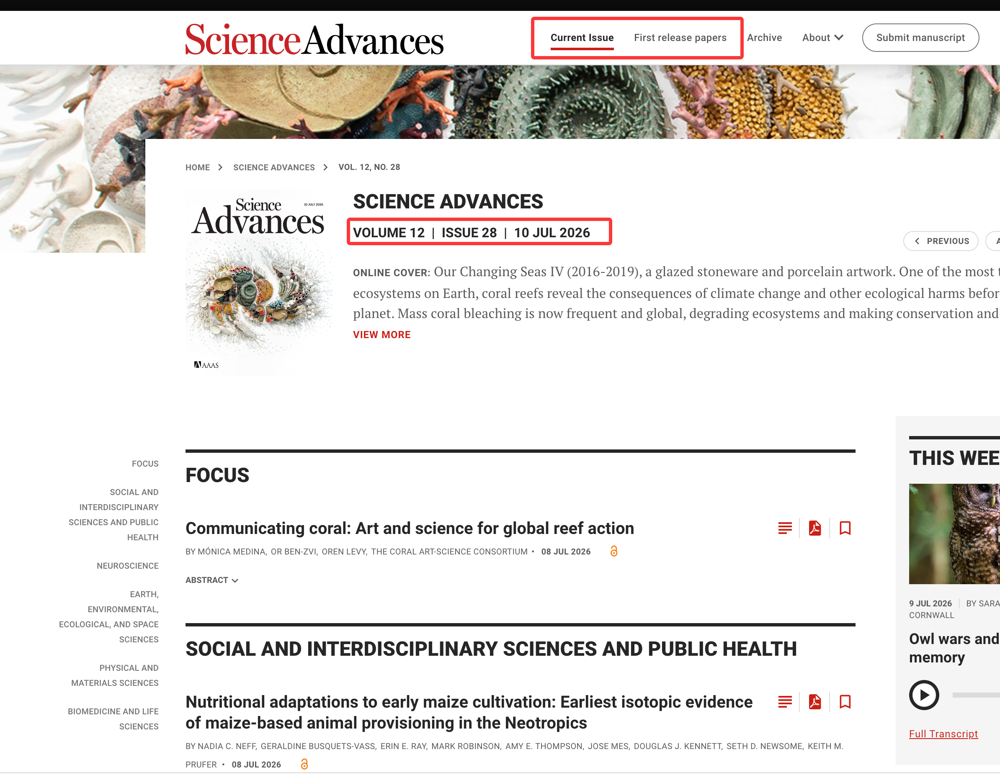
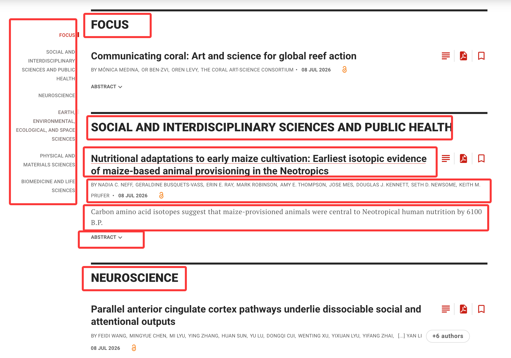
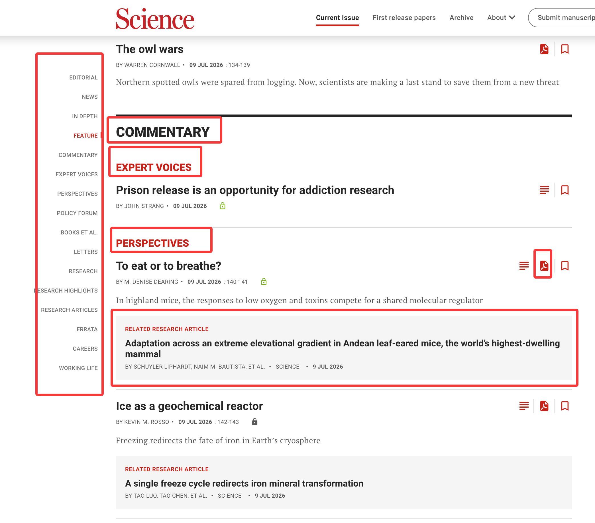
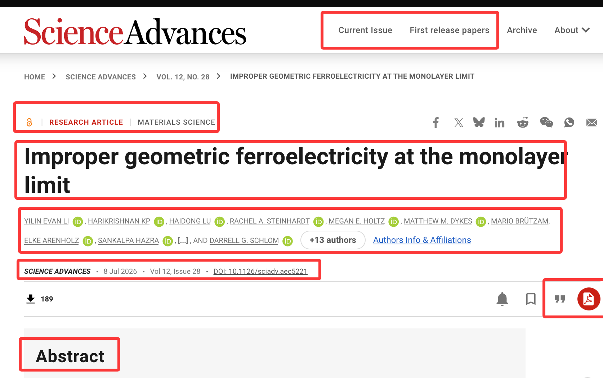

# Article Fetch

## Service ownership

`IFetchService` is the single owner of journal catalogs, source pages, article
records, article details, load state, refresh generations, and shared request
coordination. Views query it by stable ID and subscribe to relevant changes;
they do not maintain synchronized article collections or detail caches.
Fetch commits data and load state before publishing a change event. A failing
observer is reported as an unexpected error without changing the committed
operation result or preventing later observers from receiving the event.

Navigation state such as an active journal, source, or article belongs to the
view that renders it. Chat-specific article selection belongs to the addressed
Chat model keyed by `chatResource`. Sessions, the product shell, downloads,
exports, and knowledge-base services do not own copies of those states.

Downstream operations receive an `ArticleId` snapshot and resolve the required
`ArticleRecord` or `ArticleDetail` through `IFetchService` at operation start.
Cross-process calls use feature-specific DTOs; `ArticleId` and Fetch domain
objects do not move to electron-main for later lookup.

Workbench Chat owns article references stored in one addressed conversation and
its transient checked-article selection. The Sessions provider that routes a
backend request resolves explicit Article attachments through `IFetchService`
and constructs the backend-specific context DTO. Chat does not own backend
routing, and Sessions core does not own a parallel article selection.

## Runtime boundary

The environment-neutral `FetchService` runs in browser and owns Fetch domain
state, load state, request coordination, and Provider resolution. Desktop
Provider, Parser, and page-session implementations run in electron-browser,
where they can use BrowserView and Playwright services. A target without a
registered Provider still uses the same real domain service; an unavailable
Provider is an explicit registry error.

Page acquisition uses `IPlaywrightService.captureSnapshot()` and a typed
page-session ownership contract. Fetch does not expose a parallel BrowserView
DOM API, access a raw Playwright Page, or implement a private Playwright
facade.

Providers register descriptors and constructors through the Fetch registry.
The registry rejects duplicate IDs, and registrations are disposable. Parser
resolution requires exactly one match; there is no default parser or priority
fallback.

## Provider parsing

Provider parsers preserve the distinction between list discovery, list pages,
article identity, and article details:

```text
JournalDescriptor
└── ArticleListSourceGroup?
    └── ArticleListSource
        └── ArticlePage
            └── ArticleGroup?
                └── ArticleListItem
                    └── ArticleRecord
                        └── ArticleDetail
```

A list item identifies one article but is not its detail record. List parsers do
not manufacture detail fields, and detail parsers do not determine list order.
Optional values remain absent when the page provides no evidence. Parser
sharing requires fixtures demonstrating the same DOM structure and matching
conditions; similar output fields alone are insufficient.

## Nature family

### Catalog discovery

Nature-family discovery maps the site's dynamic classification into source
groups and sources:

```text
Explore content → ArticleListSourceGroup
Article type    → ArticleListSource
```

Examples include:

- Research articles
  - Article
  - Matters Arising
  - Registered Report
- Reviews & Analysis
  - Review Article
  - Perspective
- News & Comment
  - Comment
  - Correspondence
  - Editorial
  - Poster
  - Q&A

These values are parsed from the current catalog. They are not a closed public
enum and are not hardcoded into `JournalDescriptor`.

### Article lists

A Nature list item may provide:

- article type;
- published time;
- title and description;
- a truncated author list;
- image and canonical article link;
- access status when explicitly present.

Links use normalized URI fields in the provider model even when the source DOM
attribute is `href`.

Nature News and Opinion pages use a distinct list structure. Their dedicated
list parser still returns the common `ArticlePage` and `ArticleListItem`
contracts; it does not introduce a public News/Opinion article kind.

### Article details

A Nature detail may provide article type, access status, publication time,
title, complete authors, corresponding-author evidence, journal metadata,
volume, article number, citation link, abstract, and PDF URI.

Corresponding-author state is set only from an explicit semantic marker such as
the page's correspondence metadata. The parser does not infer it from author
position or anchor numbering.

## Science family

Science-family journals expose two independent sources:

- Current Issue;
- First Release.

An empty source remains a valid `ArticleListSource` with an empty page result.
It is not removed merely because it currently contains no articles.

The Current Issue structure is:

```text
Journal
└── ArticleListSource
    └── ArticlePage with IssueMetadata
        └── ArticleGroup
            └── ArticleListItem
```

Issue metadata can include volume, issue number, publication date, and canonical
issue URI. Section titles are dynamic `ArticleGroup` labels, not article types:

- Science can expose groups such as Commentary, News, and Research.
- Science Advances can expose subject-oriented groups such as Focus,
  Neuroscience, and Social and Interdisciplinary Sciences and Public Health.

### Science Advances list items

A list item may provide issue metadata, section title, article title, truncated
authors, publication time, access status, description, abstract, and PDF URI.
Description and abstract are separate optional fields. An Abstract control
without abstract content is not evidence of an abstract.




### Science list items

A Science list item may additionally provide article type, page range, and a
related article. A related article is nested under its containing list item; it
is not another top-level item in the current group. Its fields can include
relation label, URI, article type, title, truncated authors, journal title, and
publication time.



### Science-family details

Science and Science Advances details may provide access status, article type,
subject, title, complete authors, publication metadata, DOI, citation URI, PDF
URI, Editor's Summary, and abstract.

An author link such as `href="#con3"` does not identify a corresponding author.
The value remains unknown unless an explicit semantic marker exists.

Science and Science Advances share a detail parser only when fixtures prove
that their main DOM structures and matching rules are equivalent.



## RSS

RSS may supplement metadata or provide a PDF link when a provider contract
explicitly uses it. It is not the authority for website article ordering and
does not replace catalog or list-page parsing.

## Provider verification

- Add saved HTML fixtures for every supported page family.
- Test catalog discovery, empty sources, pagination, grouping, identity, and
  optional-field absence.
- Treat zero parser matches and multiple parser matches as explicit errors.
- Do not add a generic parser, priority fallback, or catch-and-try-next path.
- Do not execute scripts contained in captured HTML.
